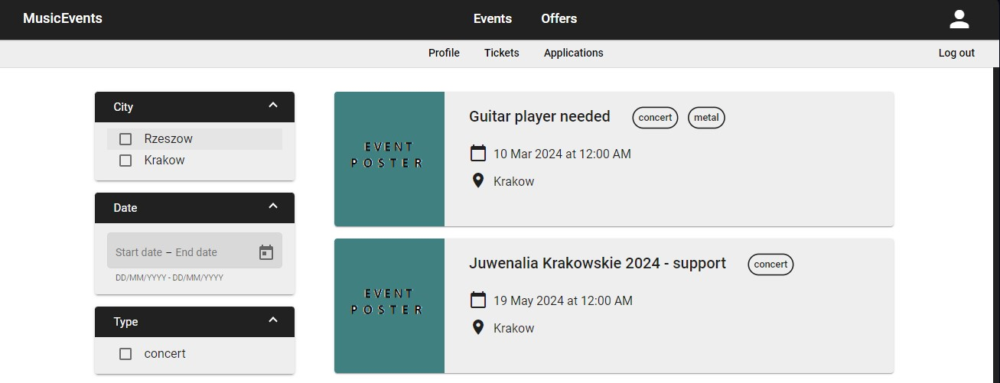

# MusicEvents App

Application related to music events, created for *Advanced design and architectural patterns* classes at the Jagiellonian University.



## Table of contents
* [General info](#about)
* [Technologies](#technologies)
* [Setup](#setup)

## About

### Motivation

**MusicEvents App** is addressed to people interested in live music, as well as musicians and music bands themselves. 
The project mostly was focused on usage of advanced design and architectural patterns for efficiency and easy addition of new features.

### Functionalities

Access to the application is granted to both registered and unregistered users, however, the last group can only *browse the list* of music events and offers tabs.
Events tab is dedicated to, as name suggests, music events, escpecially upcoming ones. Offers are related to music event planned for the future e.g. some charity events, 
supports before main concerts or just small local events. 

There are 3 types of registered users, User, Organizer, Admin with different permissions.

#### User
As a User, after log in to the application, you can: \
:star: buy tickets \
:star: apply for offers \
:star: browse the list of your applications and check their statuses \
:star: create custom *music profiles* to submit your applications faster 
  
#### Organizer
An Organizer account is an extension of User profile. Organizer is, additionally, able to: \
:star: add new offers \
:star: delete existing ones \
:star: reject/accept other users’ applcations

## Technologies
* Java 17
* Spring Boot 3
* MySQL
* Docker
* Angular 14
* Angular Material 14

## Setup

### Prerequisites

1. Download and install docker environment https://docs.docker.com/get-docker/.
2. Download and install node.js (LTS version) from ` https://nodejs.org ` .

### Installation and usage

Follow the steps below to run the app locally.
1. Clone the git repository.
2. Run ```docker-compose up``` in the music-events directory.
3. Run ``` npm install ``` in the music-events-ui root directory to install necessary packages.
4. Run ``` npm start ``` and wait for compilation to finish.
5. Navigate to `http://localhost:4200/`.
